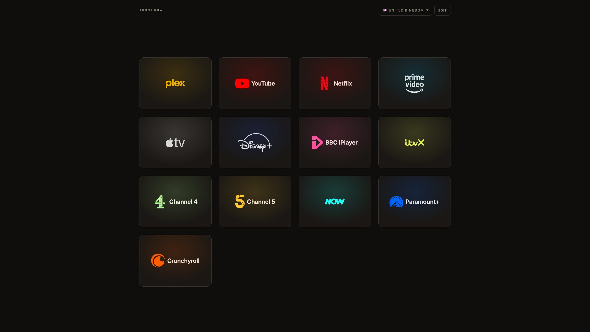

# Front Row

A streaming launcher for the Tesla browser that opens full screen. Pick a country, tap a
channel.

One file, no build step, no dependencies, no analytics and no third-party requests.

**Open it:** <https://alexluckett.github.io/tesla-front-row/>

## Set it up in the car

1. Open the address in the car's browser with `?stay` on the end:
   `https://alexluckett.github.io/tesla-front-row/?stay`.
2. Bookmark the page. `stay` removes itself from the address bar, so the bookmark saves a
   clean URL.
3. Open the bookmark. The page passes through YouTube's "you are leaving YouTube" screen;
   tap **Go to site** and Front Row opens full screen.

Practical notes:

- Video playback only works in **Park**.
- Full screen depends on the car's firmware and Tesla has closed similar tricks before. If
  it stops working, add `?fs=0` for a plain launcher in the normal browser window.

## How the full-screen trick works

The Tesla browser is a window, but the built-in **YouTube app** draws over the whole
screen. Opening `https://www.youtube.com/redirect?q=<destination>` hands the navigation to
that app, and tapping **Go to site** loads the destination inside its full-screen view.
Front Row sends itself through that redirect once when it opens; the channels then load
in the same full-screen view.

## Using it

- **Country** — the dropdown sets which channels show and which regional site each one
  opens. Defaults to the UK. It is hidden in Calls, which is the same everywhere.
- **Edit** — tap it or long-press any card. Tap a card to hide or show it; drag it to
  reorder. Tap **Done** to finish. Every section supports this, including Calls.

Settings are stored in the browser's `localStorage` on the car. There are no cookies.

## Address options

| Option | Effect |
| --- | --- |
| `?c=<code>` | Opens a given country, for example `?c=us`. |
| `?stay` | Stays in the normal browser for one load, so the page can be bookmarked. |
| `?fs=0` or `?fs=off` | Never goes full screen. |
| `?fs=all` or `?fs=on` | Sends every channel through the YouTube redirect, for a firmware where the full-screen view does not survive a normal link. |

## Sections

A bar along the bottom switches between three sections. Each keeps its own hidden channels
and its own order.

Media and Charging differ by country, so they show the country picker and save per country.
Calls is the same list everywhere: it hides the picker, and saves one set for all countries
— otherwise hiding something there, changing country in Media and coming back would quietly
undo it.

| Section | Contents |
| --- | --- |
| **Media** | The streaming channels below. |
| **Calls** | Google Meet, Microsoft Teams, Zoom, Webex, Jitsi Meet, Discord. |
| **Charging** | A Better Routeplanner and PlugShare, plus Zap-Map in the UK and Chargemap across Europe. |

Video calls need the camera and microphone, which the car's browser provides. Sign in and
Meet, Teams and Zoom all list your scheduled meetings on their landing page — there is no
comfortable way to type a meeting ID in a car.

The Calls and Charging addresses have not been checked against a live server.

## Channels

| Market | Channels |
| --- | --- |
| All markets | Plex, YouTube, Netflix, Prime Video, Apple TV, Disney+ |
| 🇬🇧 United Kingdom | + BBC iPlayer, ITVX, Channel 4, Channel 5, NOW, Paramount+, Crunchyroll |
| 🇮🇪 Ireland | + RTÉ Player, Virgin Media Play |
| 🇺🇸 United States | + Hulu, HBO Max, Peacock, Tubi, Pluto TV |
| 🇨🇦 Canada | + CBC Gem, Crave, Tubi |
| 🇦🇺 Australia | + ABC iview, SBS On Demand, 9Now, 7plus, 10 play, Stan, Binge |
| 🇩🇪 Germany | + ARD Mediathek, ZDF, Joyn, RTL+ |
| 🇫🇷 France | + france.tv, ARTE, TF1+, M6+, Canal+ |
| 🇪🇸 Spain | + RTVE Play, Atresplayer, Mitele |
| 🇮🇹 Italy | + RaiPlay, Mediaset Infinity, NOW |
| 🇳🇱 Netherlands | + NPO Start, Videoland |

## Host your own copy

To change channels or run your own copy, fork this repository and turn on GitHub Pages in
**Settings → Pages** (deploy from `main`, `/ (root)`). Any other static host works too:
upload `index.html` and nothing else is needed.

## Changing channels

Channels and markets live in the `<script id="data">` block in `index.html`:

- A channel is `{"n": "Name", "p": "<svg path>", "t": "#tint", "u": "<url>"}`. `u` may be an
  object keyed by market code for a regional URL. Leave out `p` and `t` for a name-only
  tile.
- A market is `{"c": "uk", "f": "🇬🇧", "n": "United Kingdom", "ch": [channel ids]}`. The
  dropdown is built from this list. `ch` is the Media section; `calls` and `charging` hold
  the other two, and `tabs` names them. A `tabs` entry with `"r": 1` varies by country —
  it shows the picker and saves per country; without it the section is the same everywhere.

Prime Video opens the Amazon storefront (`amazon.co.uk`, `.com`, `.de`) in the UK, US and
Germany rather than `primevideo.com`. Accounts in those markets do not play on
`primevideo.com` and are sent on to the Amazon site, so the storefront saves a hop.

To use your own logo files, see [`logos/README.md`](logos/README.md).

## Credits

Logos are inlined as SVG from these sets:

| Set | Licence | Used for |
| --- | --- | --- |
| [Simple Icons](https://github.com/simple-icons/simple-icons) v16.30.0 | CC0-1.0 | most marks |
| [CoreUI Brands](https://github.com/coreui/coreui-icons) | CC0-1.0 | Hulu |
| [selfh.st/icons](https://github.com/selfhst/icons) | CC BY 4.0 | Disney+, Prime Video |
| [Streamline Logos](https://www.streamlinehq.com/) | CC BY 4.0 | BBC iPlayer |
| [custom-brand-icons](https://github.com/elax46/custom-brand-icons) | CC BY-NC-SA 4.0 | Channel 5 |
| [gilbarbara/logos](https://github.com/gilbarbara/logos) | CC0-1.0 | Microsoft Teams |

The CC BY and CC BY-NC-SA licences require attribution, which this table provides. The
Channel 5 mark is licensed for non-commercial use only; removing the `p`, `t` and `vb`
fields from `channel5` drops the mark and the tile shows its name instead.

The logos remain the trademarks of their owners and are used here only to label links to
their services.
